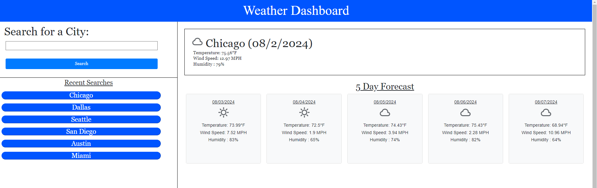

# weather-tracker

## Description
This app is useful for anyone in the world, who wants to know about the weather of a city. The current weather, temperature, wind speed, and humidity are gathered. A 5 day forecast is also displayed below

## Usage
Enter a city's name into the search bar and you will be presented with various details about today's weather, and proceeding days. Your recent searches will populate beneath the search bar and you can click on them to revisit them.

## Website Link

https://bewtaich.github.io/weather-tracker/

## License
Refer to MIT License within the repository

